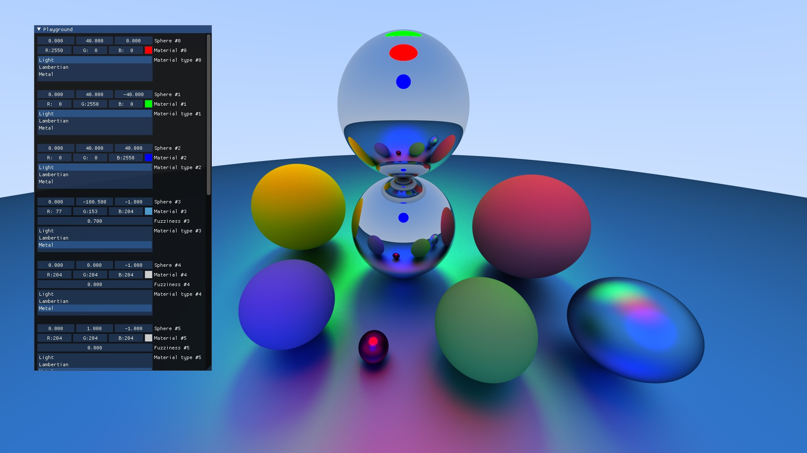

# Graphics Playground

I use this project as my "toy" engine. I'll be implementing various graphics projects in this repository. The code here is not suitable for production as everything here is subject to change.

# APIs and Libraries.
* D3D11
* Dear ImGui

I aim to implement D3D12 and/or Vulkan backends in the future. 

# Available Demos
* GPU compute version of [Peter Shirley's Ray Tracing in One Weekend](https://raytracing.github.io/)

# Work in Future
* Raytracer improvements
  * Triangle mesh support
  * Importance Sampling
  * BVH Acceleration
* Global Illumination with Voxel Cone Tracing
* Raymarching + SDF
